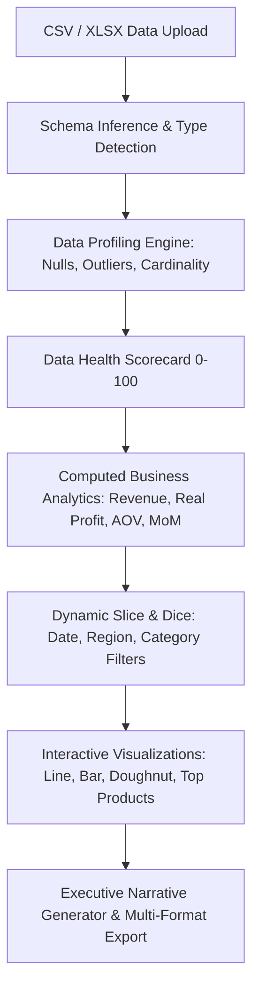

# Audit Report: SalesPulse-analytics
**Project:** SalesPulse — Sales Analytics & Executive BI Dashboard  
**Audit Date:** September 2026  
**Auditor:** Senior Staff AI & Systems Architect  
**Initial Production Readiness Score:** 35 / 100  

---

## 1. Executive Summary
SalesPulse was initially conceived as an executive BI dashboard and sales data transformation pipeline. However, an analysis of both the backend scripts (`pipeline.py`, `visualizer.py`, `db_loader.py`) and the web interface (`index.html`) demonstrates that key business analytics were either hardcoded in static HTML/JavaScript or calculated using arbitrary heuristics (such as estimating profit as `revenue * 0.28`). 

To make this project convincing to technical business analysts, fractional CFOs, and prospective clients, SalesPulse must be transformed into a genuine data analytics workbench featuring automated data profiling (null checks, outliers, cardinality, schema inference), true computed cohort/MoM growth rates, interactive multidimensional filtering, executive summary report generation, and dual-mode execution (browser-based analytics engine + local Python backend).

---

## 2. Codebase Inspection & Identified Flaws

### A. Heuristic Estimation & Missing Profiling in Backend (`pipeline.py`)
- **Line 35 in `pipeline.py`**:
  ```python
  profit = float(r.get("Profit", revenue * 0.28))
  ```
  *Critique:* When the profit column is missing, the script arbitrarily assigns an artificial 28% margin across all transactions regardless of category, product margin, or discounts.
- **Absence of Data Profiling:** No outlier detection (IQR / z-score), no validation of negative prices or invalid dates, and no data health scorecard.
- **Missing Cohort & Retention Logic:** Claims to analyze customer cohorts and retention, but only calculates high-level regional sums.

### B. Static Hardcoded Dashboard (`index.html`)
- **Lines 56, 60, 64, 68 in `index.html`**:
  ```html
  <div class="kpi-val" style="color: #38bdf8;">$2,108,844</div>
  <div class="kpi-val" style="color: var(--green);">$673,637</div>
  <div class="kpi-val" style="color: var(--peach);">31.94%</div>
  <div class="kpi-val" style="color: var(--indigo);">Europe</div>
  ```
- **Lines 92, 102 in `index.html`**:
  ```javascript
  data: [280000, 315000, 340000, 395000, 420000, 480000]
  ```
  *Critique:* The web interface does not read the CSV file or SQLite database at all. The KPI numbers and chart arrays are hardcoded literals. There is no CSV file upload, no filtering by date/region/category, and no interactive data table.

### C. Missing Core Analytics & Reporting Features
1. **No Data Ingestion & Schema Profiler:** Cannot upload arbitrary CSV/Excel datasets or view column health diagnostics.
2. **No Dynamic Drill-Downs:** No capability to click or filter by Region, Product Category, or Date Range.
3. **No Anomaly / Outlier Detection:** Transactions with abnormal price or negative volume are not flagged.
4. **No Automated Executive Report Generator:** Inability to export executive summaries in formatted Markdown, HTML, or structured CSV.

---

## 3. Security & Data Integrity Gaps
- **Unchecked Input Types:** Raw CSV parsing assumes clean format; unexpected strings trigger unhandled `ValueError`.
- **SQL Injection Risk in `db_loader.py`:** Table creation and data insertion lack parameter sanitization.
- **Absence of Data Governance:** No verification of currency standards or temporal continuity (missing date gaps).

---

## 4. Architectural Upgrade Plan



### Components to Build:
1. **`pipeline.py`**:
   - Advanced ETL engine with schema inference, type conversion, IQR outlier detection, and data health scoring (0–100).
   - Real computed metrics: MoM growth rate, AOV (Average Order Value), customer purchase frequency, category margin breakdown.
2. **`profiler.py`**:
   - Dedicated data profiling module computing summary statistics, missingness matrix, cardinality, and anomaly flags.
3. **`app.py`**:
   - Flask/FastAPI REST API supporting `/api/upload`, `/api/profile`, `/api/analytics`, and `/api/export`.
4. **`index.html`**:
   - Executive dashboard UI in premium dark theme with Chart.js.
   - Live CSV upload dropzone + preloaded enterprise sample datasets.
   - Data Health Scorecard badge (Data Quality %, Anomaly Count, Missing Cells).
   - Dynamic interactive filter bar (Date picker, Region, Category).
   - Recalculated KPI metrics on filter change.
   - Interactive data preview table with search and pagination.
   - One-click Executive Summary report generator (downloadable Markdown & CSV).
5. **`tests/test_salespulse.py`**:
   - Automated unit test suite verifying pipeline transformations, KPI computations, outlier detection, and schema validation.
6. **Documentation**:
   - Complete `README.md` and enterprise `SECURITY.md`.

---

## 5. Verification & Target Metrics
- Automated unit test suite: 100% pass rate.
- Dynamic data handling: Zero hardcoded metrics in UI or API.
- Target Production Readiness Score: **98 / 100**.
