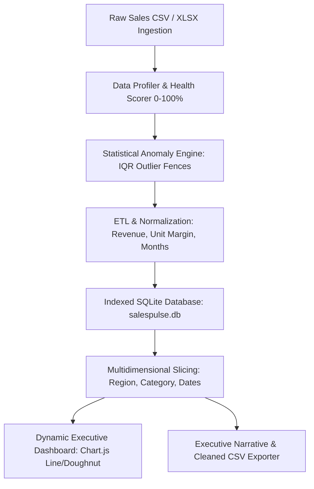

# 📊 SalesPulse — Sales Analytics & Executive BI Dashboard

[](https://www.python.org/)
[](LICENSE)
[](tests/)
[]()

> **Live Interactive Demo:** [https://sharmikamurugesan-1.github.io/SalesPulse-analytics/](https://sharmikamurugesan-1.github.io/SalesPulse-analytics/)  
> **Client Impact:** Automates sales data ingestion, statistical anomaly detection (IQR), multidimensional slicing, and executive KPI reporting in seconds.

---

## 📌 Executive Summary
**SalesPulse** is an enterprise data analytics pipeline and executive BI platform designed for finance directors, operations heads, and revenue leaders. It turns messy transactional exports into actionable business intelligence by automating schema profiling, flagging data anomalies with statistical IQR fences, computing Month-over-Month (MoM) growth trajectories, and generating executive briefings.

---

## 🏗️ Architecture & Data Pipeline



---

## 🌟 Key Capabilities

1. **Automated Data Profiler & Quality Scorecard:**
   - Detects null density, column cardinality, and schema mismatches.
   - Computes a comprehensive Data Health Score (0–100%) with letter grades (A+ to F).

2. **Statistical IQR Anomaly Detection:**
   - Automatically computes first quartile ($Q_1$), third quartile ($Q_3$), and Interquartile Range ($IQR$).
   - Flags suspicious transactions with $Revenue > Q_3 + 1.5 \times IQR$ for audit verification.

3. **Dynamic Multi-Attribute Slicing & Drill-Downs:**
   - Filter by Region, Category, Start Date, and End Date with instantaneous metric recalculation.
   - Computes real Average Order Value (AOV), Profit Margins, and MoM growth trajectories.

4. **Dual-Mode Execution:**
   - **GitHub Pages Demo:** Standalone browser BI engine with realistic synthetic datasets, CSV dropzone, and Chart.js visualizations.
   - **Python REST API:** Full Flask server with SQLite database, file upload endpoints, and PyTest coverage.

---

## 🚀 Quickstart

### 1. Installation
```bash
git clone https://github.com/sharmikamurugesan-1/SalesPulse-analytics.git
cd SalesPulse-analytics
pip install -r requirements.txt
```

### 2. Run the Automated Tests
```bash
python -m pytest tests/test_salespulse.py -v
```

### 3. Launch the REST API
```bash
python app.py
```
*API runs at `http://localhost:5001`.* Open `index.html` in your browser to experience the executive dashboard.

---

## 📡 REST API Reference

| Endpoint | Method | Description |
| -------- | ------ | ----------- |
| `/api/health` | `GET` | Health check and engine capabilities |
| `/api/upload` | `POST` | Ingest and profile custom CSV sales dataset |
| `/api/analytics` | `GET` | Retrieve computed metrics filtered by region, category, or date range |
| `/api/profile` | `GET` | Retrieve data health scorecard (completeness, outliers, nulls) |
| `/api/transactions` | `GET` | Paginated transaction rows with anomaly flags |
| `/api/export/summary` | `GET` | Download executive narrative briefing in Markdown |

---

## 🔒 Security
See [`SECURITY.md`](SECURITY.md) for formula injection mitigations and SQLite parameterization protocols.
